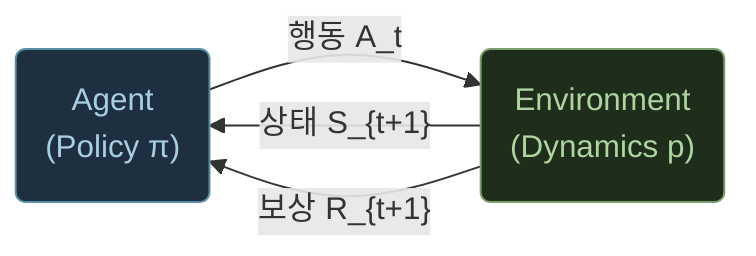
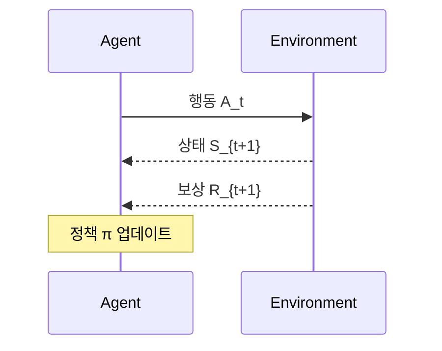

> 이 페이지는 Hugo 블로그에서 사용할 수 있는 다이어그램 방식을 비교합니다.
> 실제 블로그 글 작성 시에는 삭제하거나 draft로 변경하세요.

---

## 방식 1 — ASCII Art (기존 방식)

코드 블록에 직접 그림. 가독성이 낮고 모바일에서 깨질 수 있음.

```
        행동 A_t
Agent ──────────────→ Environment
      ←──────────────
        상태 S_{t+1}
        보상 R_{t+1}
```

---

## 방식 2 — Mermaid.js (코드블록 → 벡터 다이어그램)

마크다운 코드블록에 ` ```mermaid ` 로 작성하면 Hugo가 자동 렌더링.
**같은 페이지 안에 인라인**으로 들어감. 스타일은 페이지 테마를 따름.





---

## 방식 3 — SVG 인라인 (rawhtml shortcode)

Hugo `rawhtml` shortcode로 SVG를 직접 삽입. 완전한 디자인 제어 가능.
역시 **페이지 안에 인라인**으로 들어감.


<svg viewBox="0 0 480 160" xmlns="http://www.w3.org/2000/svg"
     style="width:100%;max-width:480px;display:block;margin:1.5rem auto;font-family:Georgia,serif;">
  <defs>
    <marker id="ah" markerWidth="8" markerHeight="6" refX="7" refY="3" orient="auto">
      <polygon points="0 0, 8 3, 0 6" fill="#c9a84c"/>
    </marker>
  </defs>
  <!-- Agent box -->
  <rect x="20" y="50" width="110" height="60" rx="8"
        fill="#1e3040" stroke="#5b8fa8" stroke-width="1.5"/>
  <text x="75" y="74" text-anchor="middle" font-size="10" fill="#8ab8d0" letter-spacing="1">POLICY π</text>
  <text x="75" y="94" text-anchor="middle" font-size="16" fill="#a8cfe0" font-weight="bold">Agent</text>
  <!-- Env box -->
  <rect x="350" y="50" width="110" height="60" rx="8"
        fill="#1e2e1a" stroke="#7a9e6e" stroke-width="1.5"/>
  <text x="405" y="74" text-anchor="middle" font-size="10" fill="#8ab890" letter-spacing="1">DYNAMICS p</text>
  <text x="405" y="94" text-anchor="middle" font-size="16" fill="#aed4a0" font-weight="bold">Env</text>
  <!-- Action arrow → -->
  <line x1="130" y1="72" x2="348" y2="72" stroke="#c9a84c" stroke-width="1.5" marker-end="url(#ah)"/>
  <text x="240" y="66" text-anchor="middle" font-size="11" fill="#c9a84c" font-style="italic">A_t</text>
  <!-- State+Reward arrow ← -->
  <line x1="350" y1="92" x2="132" y2="92" stroke="#c9a84c" stroke-width="1.5" marker-end="url(#ah)"/>
  <text x="240" y="112" text-anchor="middle" font-size="11" fill="#c9a84c" font-style="italic">S_{t+1} , R_{t+1}</text>
</svg>


---

## 방식 4 — 독립 HTML (iframe / Claude artifact 방식)

Claude가 만든 artifact HTML을 `static/demos/` 에 저장하고 `demo` shortcode로 삽입.
**완전히 분리된 페이지**가 iframe 안에서 동작. 애니메이션·인터랙션 모두 가능.



▶ Play를 누르면 타임스텝이 진행되며 실제 루프를 시각화합니다.

---

## 정리

| | ASCII | Mermaid | SVG inline | iframe (artifact) |
|---|---|---|---|---|
| **작성 난이도** | 쉬움 | 쉬움 | 보통 | Claude에게 맡김 |
| **위치** | 인라인 | 인라인 | 인라인 | 독립 페이지 |
| **인터랙션** | ❌ | ❌ | 제한적 | ✅ 완전 |
| **모바일** | ❌ 깨짐 | ✅ | ✅ | ✅ |
| **Claude 생성** | 직접 | 직접 | 직접 | artifact 그대로 사용 |

**추천**: 개념 설명에는 **Mermaid**, 인터랙티브 시각화에는 **iframe (artifact)**.
